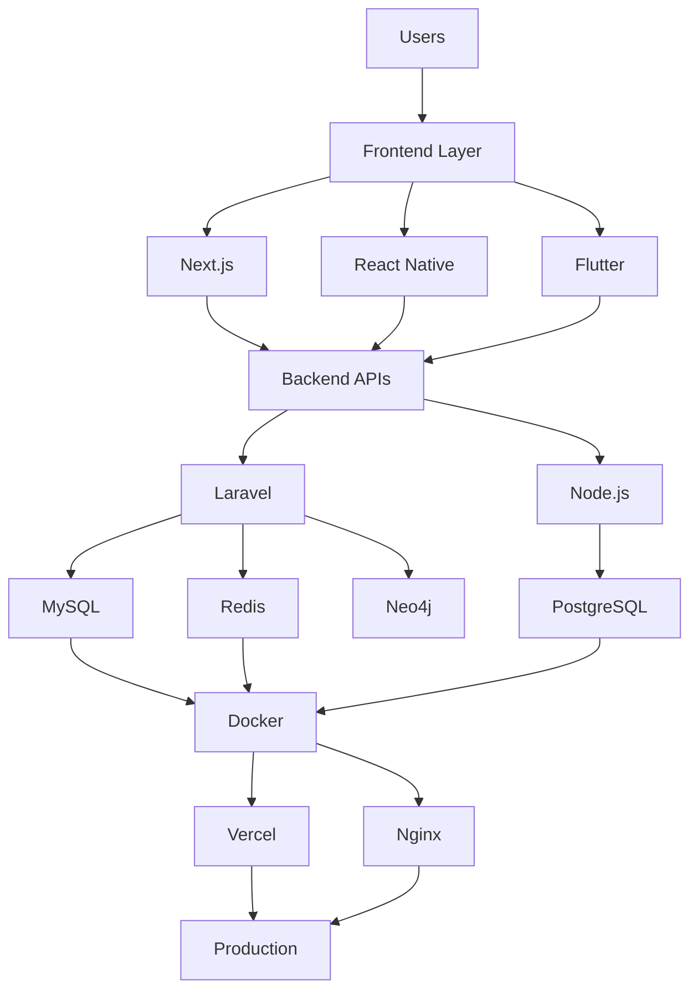

````markdown
<div align="center">


<br>

<a href="https://github.com/Aravindan-001">

</a>

<a href="https://github.com/Aravindan-001?tab=followers">

</a>

<a href="https://www.linkedin.com/in/aravindansingaram">

</a>

<a href="mailto:aravindansingaram@gmail.com">

</a>

</div>

---

# 👨‍💻 About Me

<table>
<tr>

<td width="50%">

```yaml
Name: Aravindan Singaram

Role:
  - Full Stack Developer
  - Backend Engineer
  - Mobile Developer

Education:
  Degree: B.Tech Information Technology
  College: NPR College of Engineering and Technology
  Duration: 2024 - 2028

Certification:
  - Neo4j Certified Professional
````

</td>

<td width="50%">

```yaml
Current Focus:
  - Distributed Systems
  - Data Engineering
  - Cloud Infrastructure
  - System Design

Open To:
  - Internships
  - Freelance Projects
  - Startup Collaborations
  - Open Source
```

</td>

</tr>
</table>

Building production-grade web applications, e-commerce platforms, mobile experiences, and scalable backend systems from concept to deployment.

---

# 🛠 Tech Stack

<div align="center">

### Backend Development


### Frontend Development


### Mobile Development


React Native (Expo)

### Databases


Neo4j • Meilisearch

### BaaS & Cloud


### DevOps & Tools


Vercel • Nginx • Filament • Razorpay

</div>

---

# 🏗 Engineering Ecosystem



---

# 🚀 Featured Projects

<table>

<tr>

<td width="50%">

## 💎 Svaraa Jewels

Production-grade jewelry e-commerce platform.

```yaml
Tech Stack:
  - Laravel 12
  - MySQL
  - Redis
  - Filament 5
  - Docker
  - Razorpay

Features:
  - Product Variants
  - Order Management
  - Inventory Systems
  - Queue Processing
  - Gift Cards
  - PDF Product Imports
```

🔗 [https://github.com/nexoralabs-website/svaraa-jewels](https://github.com/nexoralabs-website/svaraa-jewels)

</td>

<td width="50%">

## 🌐 Nexora Labs

Premium software agency website.

```yaml
Tech Stack:
  - Next.js 15
  - React 19
  - TypeScript
  - Supabase

Features:
  - SEO Optimization
  - Structured Data
  - Premium Animations
  - Lead Management
  - Dynamic Metadata
```

🔗 [https://github.com/nexoralabs-website/nexoralabs-website](https://github.com/nexoralabs-website/nexoralabs-website)

</td>

</tr>

<tr>

<td width="50%">

## 📈 SkillMarket AI

```yaml
Platform:
  Type: Skill Intelligence

Stack:
  - React Native
  - Supabase
  - PostgreSQL

Features:
  - Job Market Analytics
  - Personalized Recommendations
  - Secure RLS Architecture
```

</td>

<td width="50%">

## 🎓 CampusIQ

```yaml
Platform:
  Type: Placement Intelligence

Stack:
  - React Native
  - Supabase
  - NLP

Features:
  - Resume Analysis
  - Skill Gap Detection
  - Placement Readiness Score
```

</td>

</tr>

</table>

---

# 🎯 Current Focus

```yaml
Learning:
  - Distributed Systems
  - Advanced Backend Engineering
  - Data Engineering
  - Cloud Infrastructure

Building:
  - Nexora Labs
  - Svaraa Jewels
  - AI Products

Exploring:
  - Graph Databases
  - Analytics Systems
  - Workflow Automation
  - Production Monitoring
```

---

# 📊 GitHub Analytics

<div align="center">


</div>

<br>

<div align="center">


</div>

---

# 📈 Contribution Activity

<div align="center">


</div>

---

# 🏆 Highlights

```yaml
Achievements:
  - Built Svaraa Jewels as a solo full-stack developer
  - Built Nexora Labs independently
  - Developed CampusIQ end-to-end
  - Built SkillMarket AI architecture
  - Neo4j Certified Professional
  - Mentored juniors on Laravel and React Native
  - Experience deploying production applications
```

---

# 🌐 Connect

<div align="center">

<a href="mailto:aravindansingaram@gmail.com">

</a>

<a href="https://www.linkedin.com/in/aravindansingaram">

</a>

<a href="https://github.com/Aravindan-001">

</a>

</div>

---

<div align="center">


<br>

### Building scalable systems, one commit at a time.

</div>
```
