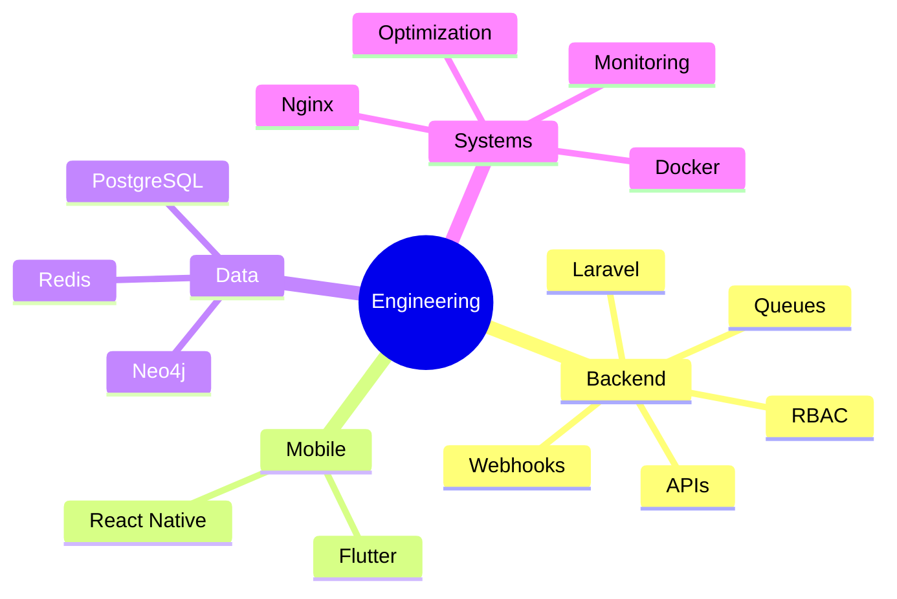

````markdown
<div align="center">


<br/>

<a href="https://github.com/Aravindan-001">

</a>

<a href="https://github.com/Aravindan-001?tab=followers">

</a>

<a href="https://www.linkedin.com/in/aravindansingaram">

</a>

<a href="mailto:aravindansingaram@gmail.com">

</a>

</div>

---

# ⚡ System Information

```yaml
name: Aravindan Singaram
role: Full Stack Developer

specializations:
  - Backend Engineering
  - Mobile Development
  - E-Commerce Systems
  - API Architecture

education:
  degree: B.Tech Information Technology
  college: NPR College of Engineering and Technology
  duration: 2024 - 2028

certifications:
  - Neo4j Certified Professional

currently_learning:
  - Distributed Systems
  - Data Engineering
  - Cloud Infrastructure
```

---

# 🧠 About Me

```typescript
class AravindanSingaram {
    role = "Full Stack Developer";

    backend = [
        "Laravel",
        "Node.js",
        "REST APIs",
        "Queue Systems",
        "Webhooks",
        "RBAC"
    ];

    frontend = [
        "Next.js",
        "React",
        "TypeScript",
        "TailwindCSS"
    ];

    mobile = [
        "React Native",
        "Flutter"
    ];

    databases = [
        "MySQL",
        "PostgreSQL",
        "MongoDB",
        "Neo4j",
        "Redis"
    ];

    currentFocus() {
        return [
            "Building scalable systems",
            "Distributed architecture",
            "Production engineering",
            "Data engineering"
        ];
    }
}
```

---

# 🛠 Technology Stack

<div align="center">

## Backend Engineering


---

## Frontend Development


---

## Mobile Development


### React Native (Expo)

---

## Databases


### Neo4j • Meilisearch

---

## Backend Services


---

## DevOps & Tools


### Razorpay • Filament • Vercel • Nginx

</div>

---

# 🚀 Featured Projects

<table>

<tr>

<td width="50%">

## 💎 Svaraa Jewels

```yaml
type: Production E-Commerce Platform

stack:
  - Laravel 12
  - MySQL
  - Redis
  - Filament 5
  - Razorpay
  - Docker

features:
  - Product Variants
  - Order Management
  - Inventory Systems
  - Queue Processing
  - PDF Imports
  - Webhook Payments
```

🔗 https://github.com/nexoralabs-website/svaraa-jewels

</td>

<td width="50%">

## 🌐 Nexora Labs

```yaml
type: Premium Agency Website

stack:
  - Next.js 15
  - React 19
  - TypeScript
  - Supabase

features:
  - SEO Optimization
  - Premium Animations
  - Lead Management
  - Server Components
  - Structured Data
```

🔗 https://github.com/nexoralabs-website/nexoralabs-website

</td>

</tr>

<tr>

<td width="50%">

## 📈 SkillMarket AI

```yaml
type: Skill Intelligence Platform

stack:
  - React Native
  - Supabase
  - PostgreSQL

features:
  - Skill Analytics
  - Personalized Learning
  - RLS Security
  - Market Insights
```

</td>

<td width="50%">

## 🎓 CampusIQ

```yaml
type: AI Placement Platform

stack:
  - React Native
  - Supabase
  - NLP

features:
  - Resume Analysis
  - Skill Gap Detection
  - Readiness Score
  - Eligibility Prediction
```

</td>

</tr>

</table>

---

# 📊 Engineering Focus

<div align="center">



</div>

---

# 🏆 Achievements

```yaml
achievements:

  - Built Svaraa Jewels as solo full-stack developer

  - Built Nexora Labs independently

  - Developed CampusIQ end-to-end

  - Built SkillMarket AI architecture

  - Neo4j Certified Professional

  - Mentored juniors on Laravel and React Native

  - Maintains technical documentation

  - Production deployment experience
```

---

# 📈 GitHub Analytics

<div align="center">


</div>

<br>

<div align="center">


</div>

---

# 🔥 Contribution Activity

<div align="center">


</div>

---

# ⚙ Current Focus

```yaml
learning:
  - Distributed Systems
  - Data Engineering
  - Backend Architecture
  - Cloud Infrastructure

building:
  - Nexora Labs
  - Svaraa Jewels
  - AI Products

exploring:
  - Graph Databases
  - Analytics Systems
  - Workflow Automation
  - Production Monitoring

available_for:
  - Internships
  - Freelance Projects
  - Startup Collaborations
```

---

# 🌐 Connect With Me

<div align="center">

<a href="mailto:aravindansingaram@gmail.com">

</a>

<a href="https://www.linkedin.com/in/aravindansingaram">

</a>

<a href="https://github.com/Aravindan-001">

</a>

</div>

---

<div align="center">


<br><br>

### ⭐ Building scalable systems, one commit at a time.

</div>
````
