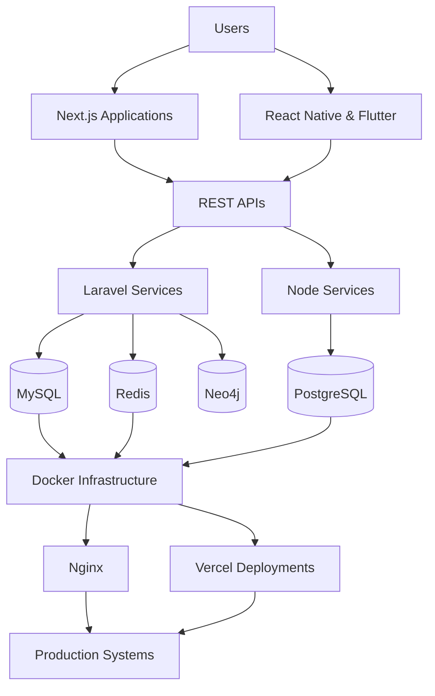

<div align="center">


<br/>

<a href="https://github.com/Aravindan-001">

</a>

<a href="https://github.com/Aravindan-001?tab=followers">

</a>

<a href="https://www.linkedin.com/in/aravindansingaram">

</a>

<a href="mailto:aravindansingaram@gmail.com">

</a>

</div>

---

# 👋 About Me

```yaml
name: Aravindan Singaram

role:
  - Full Stack Developer
  - Backend Engineer
  - React Native Developer

education:
  degree: B.Tech Information Technology
  institution: NPR College of Engineering and Technology
  duration: 2024 - 2028

certifications:
  - Neo4j Certified Professional
  - MongoDB Basics for Students
  - GitHub Copilot Prompt Engineering

interests:
  - Backend Architecture
  - Distributed Systems
  - Data Engineering
  - Cloud Infrastructure
```

I build scalable web applications, production-grade e-commerce systems, mobile applications, backend platforms, and modern developer experiences using contemporary technologies and deployment-ready architectures.

---

# 🛠 Tech Stack

### Backend

<p>

</p>

### Frontend

<p>

</p>

### Mobile Development

<p>

</p>

React Native (Expo)

### Databases

<p>

</p>

Neo4j • Meilisearch

### BaaS & Cloud

<p>

</p>

### DevOps & Tools

<p>

</p>

Vercel • Nginx • Filament • Razorpay • Supervisor

---

# 🏗 Engineering Ecosystem



---

# 🚀 Featured Projects

## 💎 Svaraa Jewels

Production-grade jewelry e-commerce platform built using Laravel.

**Technology Stack**

- Laravel 12
- MySQL 8
- Redis
- Filament 5
- Razorpay
- Docker
- Meilisearch
- Supervisor

**Highlights**

- Product variants and inventory systems
- Queue-based order processing
- Webhook-driven payment confirmations
- Coupon and gift-card workflows
- PDF product imports
- SEO optimization
- Production deployment architecture

Repository:

```text
github.com/nexoralabs-website/svaraa-jewels
```

---

## 🌐 Nexora Labs

Premium agency website built using Next.js.

**Technology Stack**

- Next.js 15
- React 19
- TypeScript
- Tailwind CSS
- Supabase
- Framer Motion
- Vercel

**Highlights**

- Server Components
- SEO optimization
- Structured Data
- Dynamic Metadata
- Premium interactions
- Lead management systems

Repository:

```text
github.com/nexoralabs-website/nexoralabs-website
```

---

## 📈 SkillMarket AI

Skill intelligence platform.

**Stack**

- React Native
- Supabase
- PostgreSQL

**Features**

- Market trend analysis
- Personalized recommendations
- Secure Row Level Security
- Analytics-driven insights

---

## 🎓 CampusIQ

Placement readiness platform.

**Stack**

- React Native
- Supabase
- NLP Systems

**Features**

- Resume analysis
- Skill-gap identification
- Placement readiness scoring
- Company eligibility predictions

---
# 🎯 Current Focus

```yaml
learning:
  - Distributed Systems
  - Data Engineering
  - Cloud Infrastructure
  - Advanced Backend Architecture

building:
  - Svaraa Jewels
  - Nexora Labs
  - AI Products

exploring:
  - Graph Databases
  - Workflow Automation
  - Analytics Systems
  - Production Monitoring

open_to:
  - Software Engineering Internships
  - Freelance Projects
  - Startup Collaborations
  - Open Source Contributions
```

---

# 📊 GitHub Analytics

<div align="center">


</div>

<br>

<div align="center">


</div>

---

# 🏆 GitHub Trophies

<div align="center">


</div>

---

# 📈 Contribution Activity

<div align="center">


</div>

---

# 📋 Profile Summary

<div align="center">


</div>

<br>

<div align="center">


</div>

<br>

<div align="center">


</div>

---

# 🏅 Professional Highlights

```yaml
highlights:

  - Neo4j Certified Professional

  - Built Svaraa Jewels end-to-end as a solo full-stack developer

  - Developed Nexora Labs independently

  - Built CampusIQ and SkillMarket AI from scratch

  - Experience with production deployments and debugging

  - Mentored peers on Laravel, React Native and Supabase

  - Active contributor on GitHub and open-source projects
```

---

# 🌐 Connect

<div align="center">

<a href="mailto:aravindansingaram@gmail.com">

</a>

<a href="https://www.linkedin.com/in/aravindansingaram">

</a>

<a href="https://github.com/Aravindan-001">

</a>

</div>

---

# 🐍 Contribution Snake

<div align="center">


</div>

---

<div align="center">

### Building scalable applications and production-ready systems.

</div>
